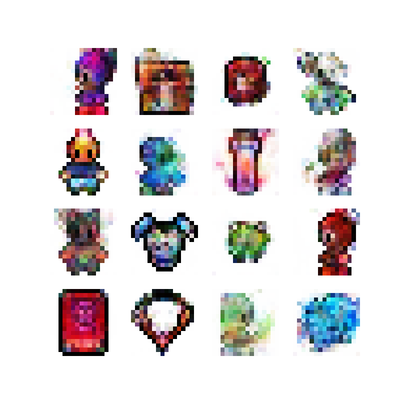

# 🎨 My Pixel Art Project (from Kaggle)

This is a project originally developed on Kaggle with the goal of **[YOUR GOAL HERE, e.g., "to create pixel art using Python" or "to train a model for generating sprites"]**.

## 👾 Final Result

Here is a sample of the art generated by the notebook:

## 🛠️ Technologies Used

This project was built primarily using the following libraries:

* Python
* TensorFlow / Keras
* Numpy
* Matplotlib

## 🚀 How to Run

To run this project:

1.  Download the notebook (`.ipynb`).
2.  Install the required dependencies.
3.  Run the cells in Jupyter Notebook, Google Colab, or Kaggle.
